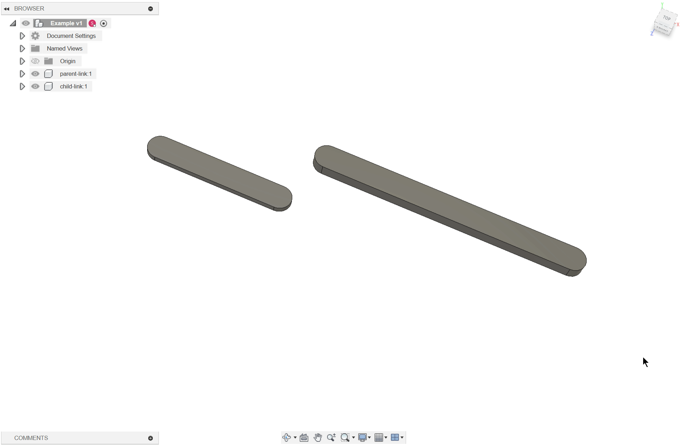
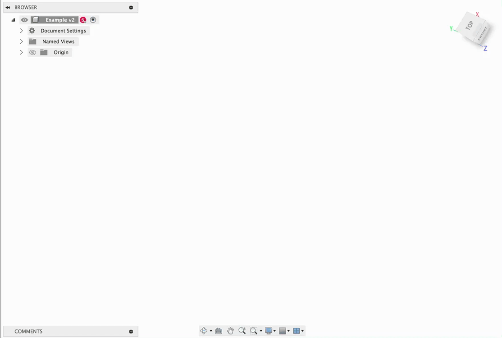
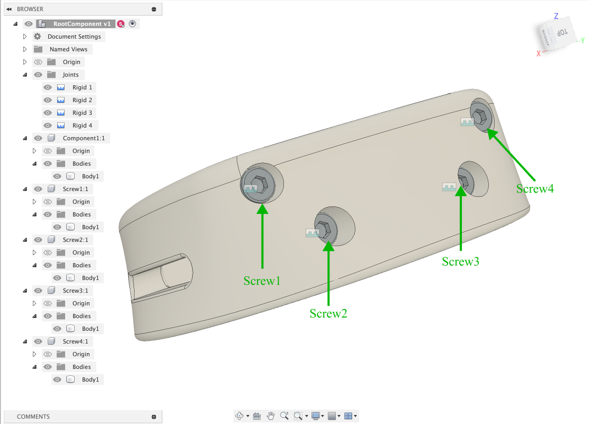
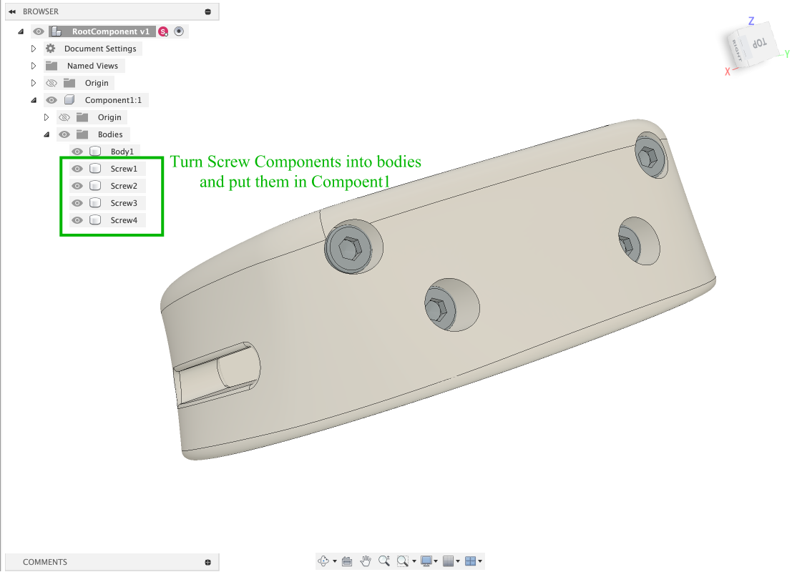

# Instructions for Fusion 360 Assembly
We recommend you assemble components in Fusion 360 with a flat structure, here are reasons:
1. flat structure is clear and make it easier to understand the structure of the robot model
2. nested structures might construct closed loop mechanisms that are unexpected and not supported by URDF which causes errors in simulation
3. nested structure is not fully tested with our add-in currently

Here we present instructions for assembling a robot in Fusion360 that is suitable for this add-in.

If you are not familiar with Fusion 360, [Fusion 360 Assemblies Tutorials](https://help.autodesk.com/view/fusion360/ENU/?guid=GUID-4008D439-DF98-4D92-AB3D-29D8E02F9BCA) provide good tutorials to practice.

## Fusion360 Terminologies
- [Body](https://help.autodesk.com/view/fusion360/ENU/?guid=GUID-C1AB4941-D7AD-4D27-A035-2FA9208635B6): a body is a container for a 3D geometry.
- [Component](https://help.autodesk.com/view/fusion360/ENU/?guid=ASM-COMPONENTS): a component is a container for design elements like sketches, construction geometry, bodies, joints, origins, and even other components.
    - root component: each Fusion 360 Document (file) contains a Root Component, represented by the top node in the browser tree.
- Occurrence: an occurrence can be seen as the instance of a component with specified location.
- [Joint](https://help.autodesk.com/view/fusion360/ENU/?guid=ASM-JOINTS): a joint is a mechanical relationship that defines the **relative position** and **motion** between 2 components in an assembly. Fusion360 supports 7 joint types which are `rigid`, `revolute`, `slider`, `cylindrical`, `pin-slot`, `planar`, and `ball`.
- [Assembly](https://help.autodesk.com/view/fusion360/ENU/?guid=GUID-38F2A3B4-CE01-4375-A21D-4CC9A743B2A1): an assembly is a collection of components that function as a single design in Fusion360. Relationship between components in a design can be defined through position, joint, and motion features.

Fusion360 provides some features which make it convenient for mechanical assembly but **might cause** problems when using this add-in, for example, rigid group feature. It is better to make a copy of an existing assembly and export the robot description files to avoid problems and modifications of the original assembly.

## Joint Operation
- For a joint which is defined by component1 and component2, the component1 would be the `child link` in robot description file and the component2 would be the `parent link`.

- Set the joint motion as `Rigid`, `Revolute`, or `Slider`. Other joint motions are not supported yet.

## Suggested Assembly Structure
It is *better* for a Fusion 360 Assembly has a **flat** tree structure which means components do not contain sub-components. Here is the example:
```
- root component
    - Origin
    - Joints
        - Joint1
        - Joint2
        - ...
    - Compoent1
        - Origin
        - Bodies
    - Component2
        - Origin
        - Bodies
    - ...
```

## Step by Steps Assembling Example
- Assemble a four bar closed chain linkage:



## Tricks
-  Replace rigid joint motion type by transforming components into bodies: 
    1. Four screws joint with component1 by fixed joint type:
    
    2. Remove all the joints and turn Screw Components into bodies and put them in Component1:
    
    3. Because bodies in a same component have a fixed relative position relationship, which provides similar features with fixed joint motion type. This will simplify robot description file without unnecessary joint elements.

