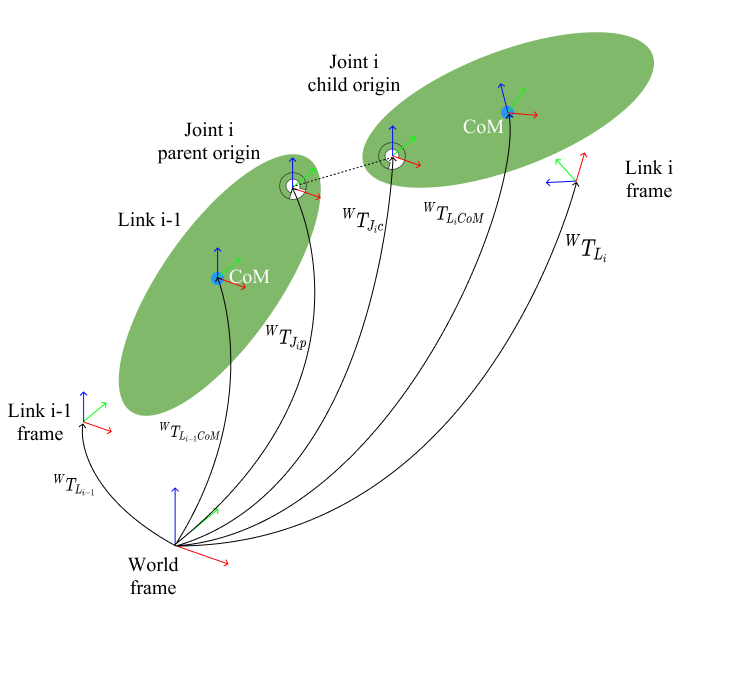
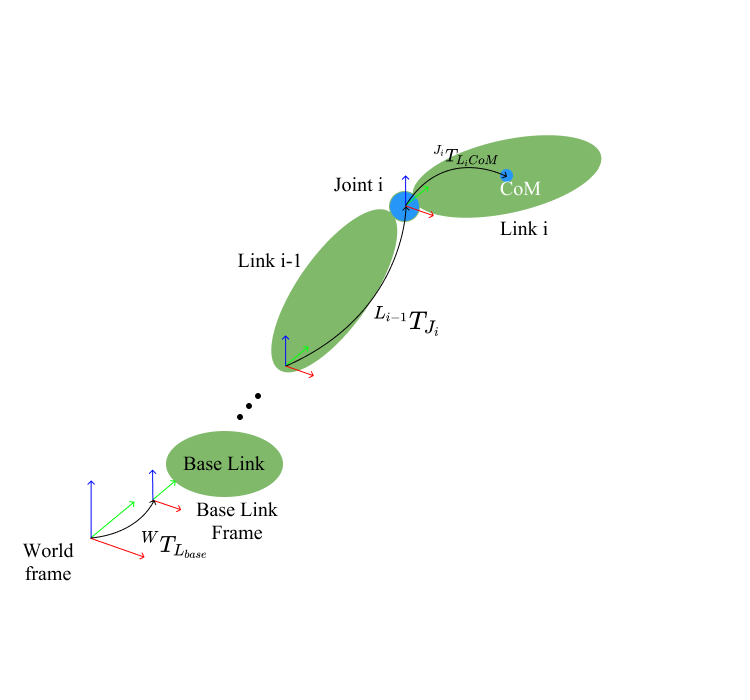
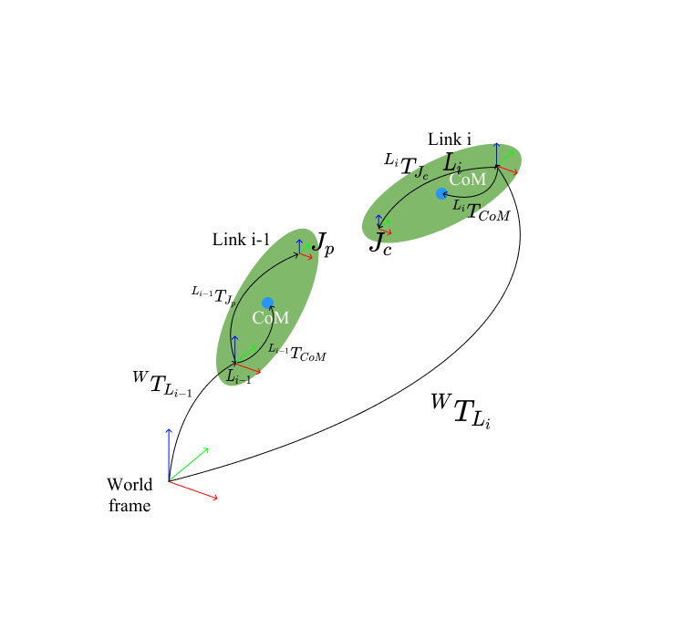

# Method Explanation
Fusion 360 API provides a unified way to return informations that can be used in URDF and SDFormat. All the coordinates, vectors is represented w.r.t world coordinate, which is the coordinate of the root component.
Thus, to make all these information is suitable for robot description format, some coordinates transformations are necessory.

## Fusion 360 Assembly Structure
Fusion 360 API provides the ability to access design model kinematics and dynamics information that is necessay for robot description format. All the elements are represented w.r.t root component frame (world frame). 
One of the benefits of this way to define elements is that information only depends on the definition of world frame, does not rely on other elements such as parent link.
This decoupled way reduces constraints in the modelling process.

## URDF Structure
URDF (Unified Robot Description Format) is a xml-based format to describe a robot. It is the most widely-used robot description format and supported by plentiful simulators. Although [URDF's specifications](http://wiki.ros.org/urdf/XML) has been expanded with abilities to model sensors and describe robot state, it is mostly used with `joint` and `link` elements in a tree structure.

Basic elements that match with a Fusion360 design are listed below:
- `<robot>`: the root element of a robot, with the required `name` attribute
  - `<link>`: defines the properties of a robot link which is a rigid body. Has required `name` attribute
    - `<inertial>`: defines the dynamics information about the link
      - `<origin>`: defines the link's CoM frame *C* w.r.t the link-frame *L* which is the same as the joint-frame *J* which is defined in `<joint>` element by `xyz` and `rpy` attributes
      - `<mass>`: defines the mass of the link by `value` attribute
      - `<inertia>`: defines the inertia tensor of the link w.r.t the CoM frame *C* by `ixx`, `iyy`, `izz`, `izy`, `ixz`, and `iyz` attributes
    - `<visual>`: defines the visual properties of the link. Multiple instances of `<visual>` elements can exist for the same link that causes the union of the geometry represents the link's visual geometry
      - `<origin>`: defines the visual element's frame w.r.t the link frame *L* by `xyz` and `rpy` attributes
      - `<geometry>`: defines the shape of the visual object, usually uses the `<mesh>` sub-element to define.
    - `<collision>`: defines the collision properties of the link with similar conventions to `<visual>` element
      - `<origin>`: defines the collision element's frame w.r.t the link frame *L* by `xyz` and `rpy` attributes
      - `<geometry>`: defines the shape of the collision object, usually uses the `<mesh>` sub-element to define.
  - `<jont>`: defines the kinematics and dynamics properties of a joint, requires `name` and `type` attributes
    - `<origin>`: defines the transform from the parent link to the child link by `xyz` and `rpy` attributes and the joint is located at the child link
    - `<axis>`: specify the joint axis with a normalized vector in joint frame
    - `<parent>`: the parent link which is defined by `link` attribute using the link name
    - `<child>`: the child link which is defined by `link` attribute using the link name
    - `<limit>`: defines the joint limitations by `lower`, `upper`, `effort`, and `velocity` attributes

URDF defines child link(joint) information relied on parent link information, this makes information representation in URDF concise, but creates constrains to model robot using URDF. 

## SDF Structure
SDFormat (Simulation Description format) is a xml-based format that  can contain information not only about robots but also about environments. Its [specifications](http://sdformat.org/spec) are similar to URDF but with more abilities. Here we focus on the element `<model>` which mostly represents the robot.

Although the `<model>` element of SDFormat has more sub-elements to describe a robot, here we only introduce basic elements that can match a Fusion360 design. 
- `<model>`: model element is used to define a complete robot or any other physical object. The `name` attribute is required.
  - `<link>`: represents robot's link inside `<model>` element with the required `name` attribute.
    - `<pose>`: defines the link-frame *L* **w.r.t the parent element** which is the `<model>` in a `<x>`, `<y>`, `<z>`, `<r>`, `
`, `<y>` form
    - `<inertial>`: defines the dynamics information about the link
      - `<mass>`: the mass of the link
      - `<pose>`: defines the link's center-of-mass-frame *C* w.r.t the link-frame *L*
      - `<inertia>`: defines the inertia tensor in center-of-mass-frame *C*
        - `<ixx>`: the link's moment of inertia about the CoM frame *C*'s x-axis
        - `<ixy>`: the link's product of inertia about CoM frame's x-axis and y-axis
        - `<ixz>`: the link's product of inertia about CoM frame's x-axis and z-axis
        - `<iyy>`: the link's moment of inertia about the CoM frame *C*'s y-axis
        - `<iyz>`: the link's product of inertia about CoM frame's y-axis and z-axis
        - `<izz>`: the link's moment of inertia about the CoM frame *C*'s z-axis
    - `<collision>`: defines collision geometry of the link with required `name` attribute
    - `<visual>`: defines visual properties of the link with required `name` attribute
  - `<joint>`: defines a joint with required `name` and `type` attributes
    - `<parent>`: defines the name of the parent frame (conventionally the parent link frame) or "world"
    - `<child>`: defines the name of the child frame (conventionally the child link frame)
    - `<axis>`: defines the axis for joint motion
      - `<xyz>`: expressed the axis with a unit vector in `<x>` `<y>` `<z>` form w.r.t the joint frame *J*
      - `<limit>`: defines the limits of the joint with this axis
        - `<lower>`: lower joint limit (radians for revolute joints, meters for prismatic joints)
        - `<upper>`: upper joint limit (radians for revolute joints, meters for prismatic joints)
    - `<axis2>`: the second axis for some special joint type
      - `<xyz>`: expressed the axis with a unit vector in `<x>` `<y>` `<z>` form w.r.t the joint frame *J*
      - `<limit>`: defines the limits of the joint with this axis
        - `<lower>`: lower joint limit (radians for revolute joints, meters for prismatic joints)
        - `<upper>`: upper joint limit (radians for revolute joints, meters for prismatic joints)
    - `<pose>`: defines the joint frame *J*. By default, the joint frame is expressed in the child link frame

## Fusion 360 to URDF
| URDF Element | Fusion 360 Elements | Transformation |
| ------------ | ------------------- | -------------- |
| Joint *i* origin $^{L_{i-1}}T_{J_{i}}$| $^{W}T_{L_{i-1}}$, $^{W}T_{J_{i}}$ | $^{L_{i-1}}T_{J_{i}} = {(^{W}T_{L_{i-1}})}^{T} \cdot {^{W}T_{J_{i}}}$ |
| Joint *i* axis $^{J_{i}}\vec{a}$| $^{W}\vec{a}$, $^{W}T_{J_{i}}$| $^{J_{i}}\vec{a} = {(^{W}T_{J_{i}})}^{T} \cdot ^{W}\vec{a}$ |
| Link *i*'s inertial origin $^{J_{i}}{T_{L_{i}CoM}}$ | $^{W}T_{J_{i}}$, $^{W}{T_{L_{i}CoM}}$ | $^{J_{i}}{T_{L_{i}CoM}} = {(^{W}T_{J_{i}})^{T}} \cdot {^{W}{T_{L_{i}CoM}}}$ |
|Link *i*'s visual origin $^{J_{i}}T_{L_{i}}$ | $^{W}T_{J_{i}}$, $^{W}T_{L_{i}}$ | $^{J_{i}}T_{L_{i}} = {(^{W}T_{J_{i}})^{T}} \cdot {^{W}T_{L_{i}}}$ |
|Link *i*'s collision origin $^{J_{i}}T_{L_{i}}$ | $^{W}T_{J_{i}}$, $^{W}T_{L_{i}}$ | $^{J_{i}}T_{L_{i}} = {(^{W}T_{J_{i}})^{T}} \cdot {^{W}T_{L_{i}}}$ |

## Fusion 360 to SDFormat
| SDF Element | Fusion 360 Elements | Transformation |
| ----------- | ------------------- | -------------- |
| Joint *i* pose $^{L_{i}}T_{J_{iC}}$ | $^{W}T_{L_{i}}$, $^{W}T_{J_{iC}}$ | $^{L_{i}}T_{J_{iC}} = {(^{W}T_{L_{i}})^{T}} \cdot {^{W}T_{J_{iC}}}$|
| Joint *i* axis1 $^{J_{iC}}\vec{a_1}$| $^{W}\vec{a_1}$, $^{W}T_{J_{iC}}$ | $^{J_{iC}}\vec{a_1} = {(^{W}T_{J_{iC}})^{T}} \cdot {^{W}\vec{a_1}}$ |
| Joint *i* axis1 $^{J_{iC}}\vec{a_2}$| $^{W}\vec{a_2}$, $^{W}T_{J_{iC}}$ | $^{J_{iC}}\vec{a_2} = {(^{W}T_{J_{iC}})^{T}} \cdot {^{W}\vec{a_2}}$ |
| Link *i*'s pose $^{W}T_{L_{i}}$ | $^{W}T_{L_{i}}$ | $^{W}T_{L_{i}} = {^{W}T_{L_{i}}}$ |
| Link *i*'s inertial pose $^{L_{i}}T_{L_{i}COM}$ | $^{W}T_{L_{i}}$, $^{W}{T_{L_{i}CoM}}$ | $^{L_{i}}T_{L_{i}COM} = {(^{W}T_{L_{i}})^{T}} \cdot {^{W}{T_{L_{i}CoM}}}$ |
